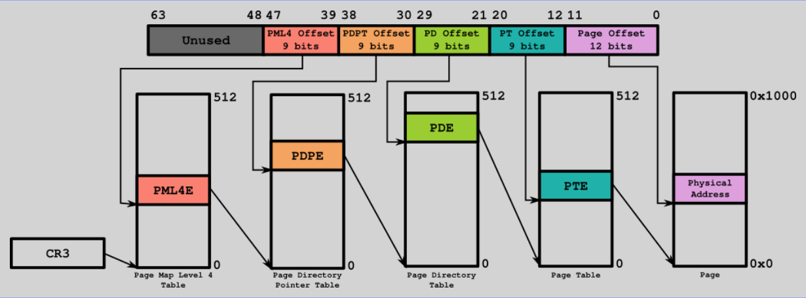
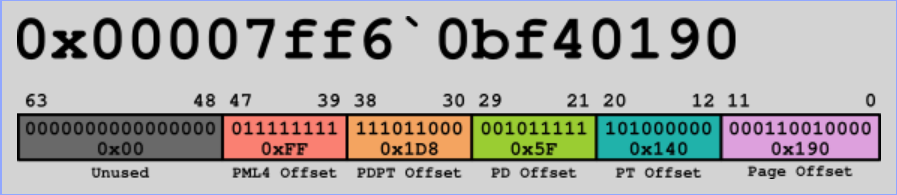
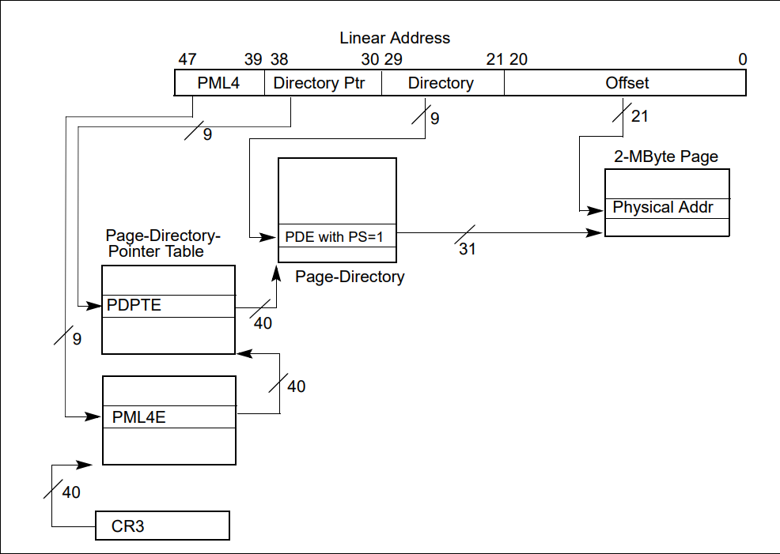

# Paging

## Overview
Paging is the foundation of modern memory management on x86 processors. It allows the CPU to translate virtual addresses used by programs into physical addresses in RAM, providing isolation, protection, and efficient use of memory.  
After entering protected mode, **EchoOS** sets up paging to prepare for advanced memory management and the eventual transition to long mode.

In EchoOS, paging is implemented using **2 MiB huge pages**, providing a clean and efficient identity map of low memory without the need for multiple page table layers. This ensures the system can enable paging quickly and safely during the early boot process.

## Paging Methodologies on x86
Over time, the x86 architecture has introduced several paging mechanisms.

| Method | Addressing Mode | Levels | Max Physical Address | Notes |
|--------|------------------|---------|------------------------|-------|
| **32-bit Paging** | 32-bit protected mode | 2 (Page Directory → Page Table) | 4 GB | 4 KiB pages only |
| **PAE Paging** | 32-bit with PAE enabled | 3 (PDPT → PD → PT) | 64 GB | Adds 36-bit addressing and 64-bit entries |
| **4-Level Paging** | 64-bit mode (long mode) | 4 (PML4 → PDPT → PD → PT) | 256 TB | Used in all x86-64 systems today |
| **5-Level Paging** | 64-bit mode (optional, from Intel 5-level extension) | 5 (PML5 → PML4 → PDPT → PD → PT) | 4 PB | Extends virtual space for future scalability |

**EchoOS** uses **4-level paging** for compatibility with standard 64-bit CPUs but simplifies the structure by using **2 MiB large pages**, skipping the lowest level (Page Table).


## Address Translation and Hierarchy

In modern x86-64 systems, each virtual address is broken into fields that index a hierarchy of tables:
```
Virtual Address → [PML4] → [PDPT] → [PD] → [PT] → Physical Page
```
Each entry in these tables contains:
- The **physical base address** of the next-level table (or page frame)
- Control flags (Present, Writable, User/Supervisor, Page Size, etc.)


4-Level Paging diagram


Virtual address translation


When the **PS (Page Size)** flag is set in a Page Directory entry, the CPU treats it as a **2 MiB huge page**, bypassing the lowest Page Table level. EchoOS uses this mechanism for its early mappings.




## Paging Configuration in EchoOS

EchoOS implements paging at the end of its 32-bit protected mode setup. The bootloader constructs the paging structures **statically** in memory before enabling the paging bit in `CR0`. The configuration focuses on two goals:

1. **Identity Map Low Memory**  
   All memory regions needed for boot (the loader, GDT, stack, and page tables) are identity-mapped — meaning virtual addresses equal physical addresses. This ensures no surprises when paging is enabled.

2. **Map the Kernel Region**  
   The kernel is loaded into higher memory (e.g., at `0x100000` or above). This region is also mapped using large 2 MiB pages, so the CPU can directly jump to the 64-bit entry point without faults.

By using 2 MiB huge pages, EchoOS avoids having to create and fill thousands of 4 KiB entries. Each large page descriptor covers 2 MiB of memory with a single entry, simplifying initialization and minimizing memory footprint.

### Why Huge Pages?
- **Simpler table setup** – Fewer structures to initialize (only PML4, PDPT, and PD).  
- **Faster early boot** – Less memory scanning and smaller code path.  
- **Efficient mapping** – Each entry covers a large contiguous region, ideal for low-memory identity mapping.  
- **Consistent with long-mode requirements** – Huge pages are natively supported once 64-bit mode is active.


## Paging Registers and Activation

To activate paging, the CPU requires several control bits to be set in sequence:

| Register | Bit | Purpose |
|-----------|-----|----------|
| **CR3** | — | Holds the physical address of the top-level paging structure (PML4) |
| **CR4.PAE** | Bit 5 | Enables Physical Address Extension (required for 64-bit page format) |
| **IA32_EFER.LME** | Bit 8 | Enables long mode (though not yet active until CR0.PG = 1) |
| **CR0.PG** | Bit 31 | Enables paging globally |

### Activation Sequence
1. Load `CR3` with the address of the PML4 table.  
2. Set `CR4.PAE = 1` to use PAE/long mode–style entries.  
3. Set the `LME` bit in `IA32_EFER` (enabling 64-bit page translation format).  
4. Set `CR0.PG = 1` to enable paging.  

After these steps, the CPU begins using the paging structures created earlier, and all memory accesses go through translation.


## Page Flags and Alignment

Each paging entry used by EchoOS (64-bit descriptor) follows Intel’s format:

| Bit | Name | Description |
|------|------|-------------|
| 0 | **P** (Present) | Must be 1 for active entries |
| 1 | **RW** (Read/Write) | 1 = Writable |
| 2 | **US** (User/Supervisor) | 0 = Supervisor‑only |
| 7 | **PS** (Page Size) | 1 = This entry maps a 2 MiB page |
| 63 | **NX** (No Execute) | 1 = Page cannot execute (if NXE enabled) |

All tables and pages in EchoOS are aligned to **4 KiB** boundaries to meet hardware requirements.


## Identity Mapping Example

To visualize EchoOS’s memory layout during the transition:

| Virtual Address | Physical Address | Description |
|------------------|------------------|--------------|
| `0x00000000` – `0x001FFFFF` | `0x00000000` – `0x001FFFFF` | Loader, stack, and BIOS data (identity-mapped) |
| `0x001FFFFF` – `0x003FFFFF` | `0x001FFFFF` – `0x003FFFFF` | Kernel image (2 MiB page) |
| Higher addresses | Same as physical | Reserved for future paging expansion |

> The loader ensures all critical code and data are covered by these mappings before paging is enabled.


## Summary

- Paging allows the CPU to translate virtual to physical addresses.  
- x86 supports several paging models: 32‑bit, PAE, 4‑level, and 5‑level.  
- **EchoOS uses 4‑level paging** with **2 MiB huge pages** for simplicity and performance.  
- The bootloader identity‑maps low memory and maps the kernel’s region before enabling paging.  
- Paging is activated by setting `CR3`, enabling PAE, setting LME, and finally turning on CR0.PG.  
